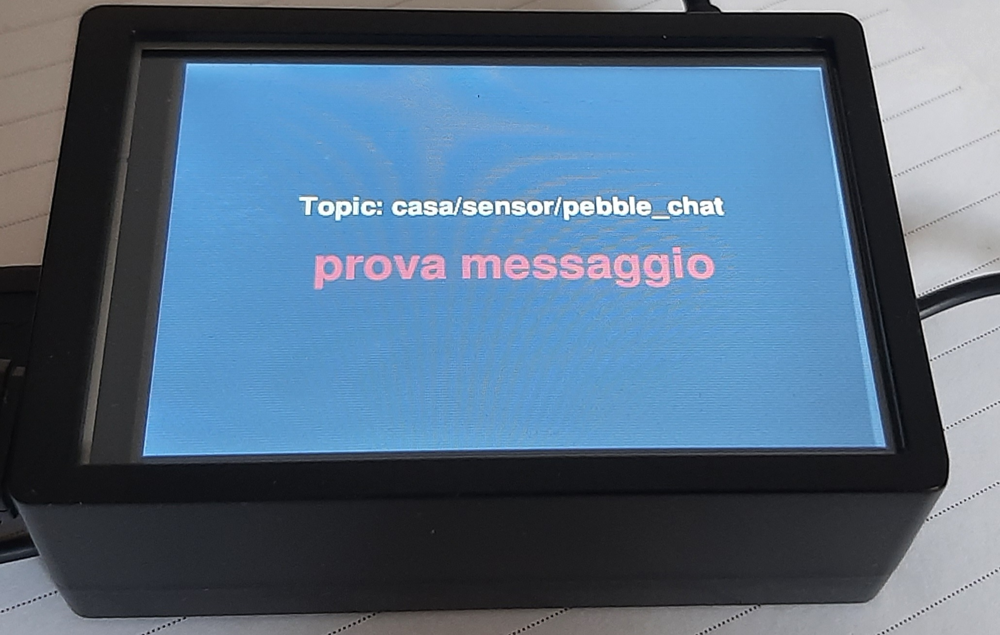

# Display MQTT per Raspberry Pi su Schermo SPI

Un'applicazione per visualizzare i messaggi da un topic MQTT su un piccolo schermo SPI (es. 3.5") collegato a un Raspberry Pi. Il rendering avviene direttamente sul framebuffer della console, senza la necessità di un ambiente desktop.



## 📜 Descrizione

Questo progetto è ideale per creare un piccolo display di stato o un monitor di dati per sistemi domotici o progetti IoT. Include due implementazioni con le stesse funzionalità: una in **Python** (`main.py`) e una in **C++** (`main.cpp`).

Entrambe le versioni sono ottimizzate per funzionare in un ambiente minimale (Raspberry Pi OS Lite) e includono workaround specifici per la scrittura diretta sul framebuffer.

## ✨ Funzionalità

*   **Visualizzazione Dati MQTT**: Si connette a un broker MQTT e mostra in tempo reale i messaggi ricevuti su un topic specifico.
*   **Configurazione Guidata**: Al primo avvio, richiede interattivamente i dati del server MQTT (IP, utente, password, topic) e li salva in `config.json`.
*   **Rendering senza Desktop**: Utilizza `pygame` (Python) o `SDL2` (C++) per disegnare testo direttamente sul framebuffer (es. `/dev/fb1`), eliminando la necessità di un server X.
*   **Ottimizzato per Schermi SPI**: Gestisce la profondità di colore a 16-bit (RGB565), comune per questi display.
*   **Interfaccia Touch**: Include un pulsante "X" per chiudere l'applicazione e un indicatore visivo del tocco.
*   **Avvio Automatico**: Fornisce un file di servizio `systemd` per l'avvio automatico all'accensione.

---

## 🐍 Versione Python (`main.py`)

### Requisiti Python

*   Python 3
*   Librerie: `pygame`, `paho-mqtt`

### Installazione e Uso (Python)

1.  **Installa le dipendenze:**
    ```bash
    sudo apt update
    sudo apt install python3-pygame python3-paho-mqtt
    ```

2.  **Configura i permessi utente:**
    Per permettere allo script di scrivere sul framebuffer e leggere il touchscreen, l'utente deve far parte dei gruppi corretti.
    ```bash
    sudo usermod -a -G tty,video,input $USER
    ```
    Dopo aver eseguito questo comando, **è necessario riavviare il Raspberry Pi**.

3.  **Esegui lo script:**
    ```bash
    python3 main.py
    ```
    Al primo avvio, seguirà una configurazione guidata.

---

## C++ Versione (`main.cpp`)

Questa versione offre prestazioni superiori e un consumo di risorse inferiore rispetto a Python.

### Requisiti C++

*   Librerie di sviluppo: `build-essential`, `libsdl2-dev`, `libsdl2-ttf-dev`, `libpaho-mqtt-dev`, `nlohmann-json3-dev`

### Installazione e Compilazione (C++)

1.  **Installa le dipendenze:**
    ```bash
    sudo apt update
    sudo apt install build-essential libsdl2-dev libsdl2-ttf-dev libpaho-mqtt-dev nlohmann-json3-dev fonts-dejavu-core
    ```

2.  **Configura i permessi utente** (se non già fatto per la versione Python):
    ```bash
    sudo usermod -a -G tty,video,input $USER
    ```
    **Riavvia il Raspberry Pi** dopo aver eseguito il comando.

3.  **Compila il programma:**
    Il progetto include un `Makefile` che semplifica la compilazione. Esegui semplicemente:
    ```bash
    make
    ```

### Utilizzo (C++)

Dopo la compilazione, esegui il programma:
```bash
sudo ./main
```
Se il file `config.json` non esiste, verrà avviata la procedura di configurazione guidata.

---

## ⚙️ Avvio Automatico con `systemd` (Consigliato per C++)

Per far partire il display automaticamente all'accensione del Raspberry Pi, puoi usare il file di servizio `systemd` incluso.

1.  **Installa il servizio:**
    Questo comando compila il programma (se necessario) e copia il file `.service` nella cartella di sistema.
    ```bash
    make install
    ```

2.  **Abilita e avvia il servizio:**
    ```bash
    sudo systemctl enable --now mqtt-display.service
    ```

### Comandi Utili per il Servizio

*   **Vedere lo stato:** `sudo systemctl status mqtt-display.service`
*   **Vedere i log:** `journalctl -u mqtt-display.service -f`
*   **Fermare il servizio:** `sudo systemctl stop mqtt-display.service`
*   **Riavviare il servizio:** `sudo systemctl restart mqtt-display.service`

## 🔧 Troubleshooting

*   **"Errore: Dispositivo /dev/fb1 non trovato"**:
    Lo schermo non è rilevato all'indirizzo previsto. Verifica che i driver dello schermo siano installati e attivi. Potrebbe essere necessario modificare il codice per usare `/dev/fb0`.

*   **"Errore permessi" / Il Touch non funziona**:
    L'utente non ha i permessi necessari. Assicurati di aver aggiunto l'utente ai gruppi `video`, `tty` e `input` e di aver **riavviato** il sistema.

*   **Il programma non parte come servizio (errore 203/EXEC)**:
    Verifica che i percorsi nel file `mqtt-display.service` (`ExecStart` e `WorkingDirectory`) siano corretti, specialmente se contengono spazi (in quel caso, usa le virgolette).